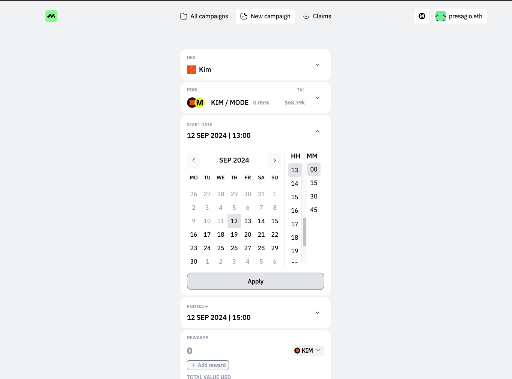

# Creating a Campaign

3 Simple Steps to Launch Your First Campaign

Creating a campaign involves a quick 3 step process - choose the DEX/Pair that you want to run the incentives on, pick the duration and then choose the rewards.

Here's a 2 minute video about how to create a campaign with Metrom



### Step 1: Select Your Pair&#x20;

Click the "Pick the pool" you want to incentivize.&#x20;

<figure><figcaption></figcaption></figure>

### Step 2: Choose the Duration

Select the start and end dates, along with the time, for your campaign. The time displayed here is your local time.

<figure><figcaption></figcaption></figure>

<figure><figcaption></figcaption></figure>

### Step 3: Choose the reward tokens



Pick the rewards and its amount and click on Campaign Preview.

### CAMPAIGN PREVIEW

Take a quick look at the preview and then Launch campaign :tada:

<figure><figcaption></figcaption></figure>

***

**Follow us on** [**X**](https://twitter.com/metromxyz)**, or Join us on** [**Discord**](https://discord.com/invite/S2kBEAGWbM) **or** [**Telegram**](https://t.me/metrom\_xyz)&#x20;
